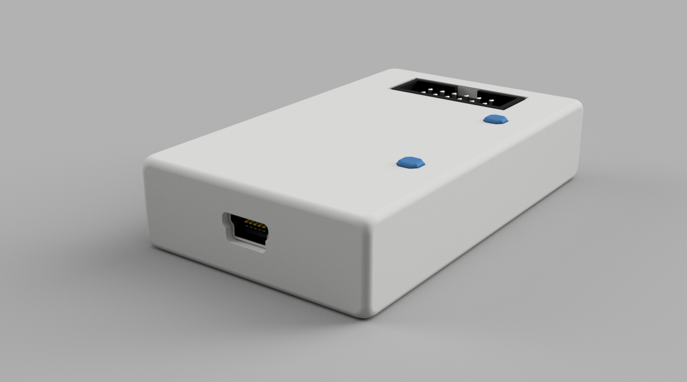
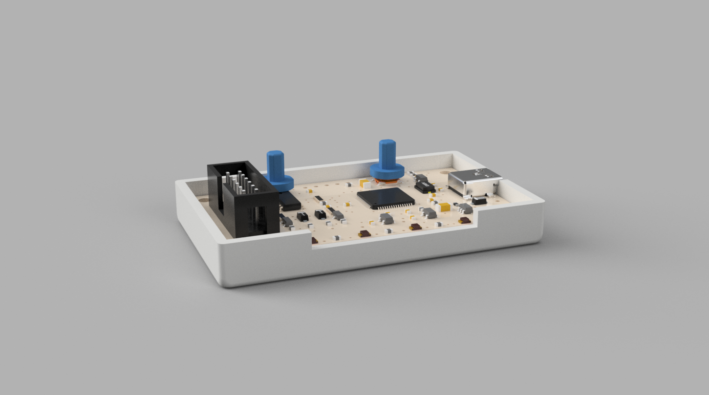
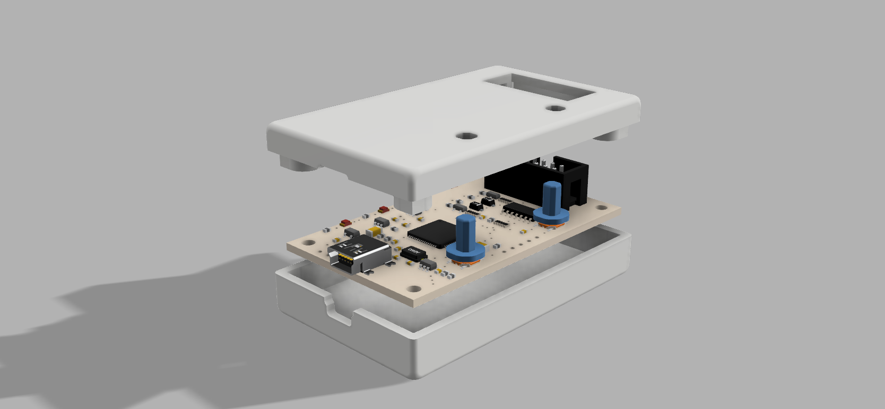
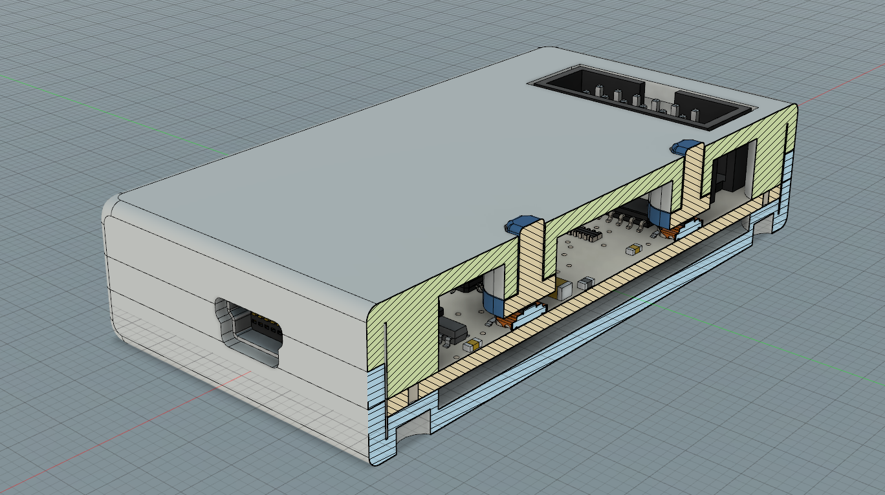

# Bus Pirate Enclosure for BP v.4.0

Designed in Fusion 360 based on Eagle Board files downloaded from [Dangerous Prototype's GitHub repo](https://github.com/DangerousPrototypes/Bus_Pirate)

I have used the following process to create a 3d model of the v4.0 PCB:

* uploaded Eagle .brd file to [ECAD.io](http://ecad.io)
* carefully selected the components from the quite cumbersome UI of ECAD.io
* generated a STEP assembly
* opened the assembly in Autodesk Fusion 360
* saved it as a Fusion 360 model
* created a new document and added the PCB model to it
* designed the case around the model using projected shapes and boundaries
* the two parts are carefully designed with no over-hangs

__note__: these models have very tight tolerances in some areas and no tolerance at all in others.
This is possible because my Ultimaker is calibrated extremely well and I use an Olsson Block 0.4mm diameter.
I print at 0.06 layer height with layer 0 printed at 0.1.
An acetate sheet is glued to the build-plate glass to allow for easy removal of the parts (see [this video](https://www.youtube.com/watch?v=MMxrqxx-Fjg) on my YT channel)
I only use [Rigid.ink PLA](http://rigid.ink) because of its quality and strength.
Models are printed one at a time.

The model is made in 2 main parts (bottom and top) plus the buttons.
I have created a Simplify3D factory file with settings for my Ultimaker 2 printer.

### downloads
#### STL
[Bottom](models-STL/Bottom.STL)
[Top](models-STL/Top.STL)
[Buttons](models-STL/Buttons.STL)

#### Fusion 360 (.F3D)
[Assembly](models-Fusion360/BusPirate_v4.0_Case.f3d)

#### Simplify3D
